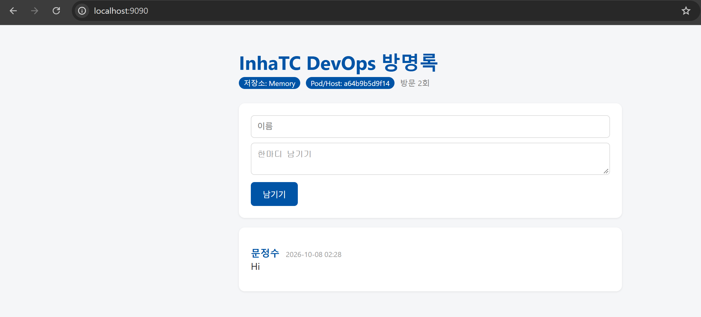
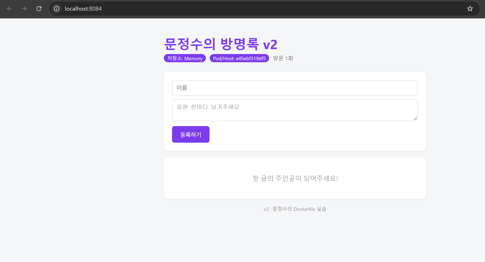
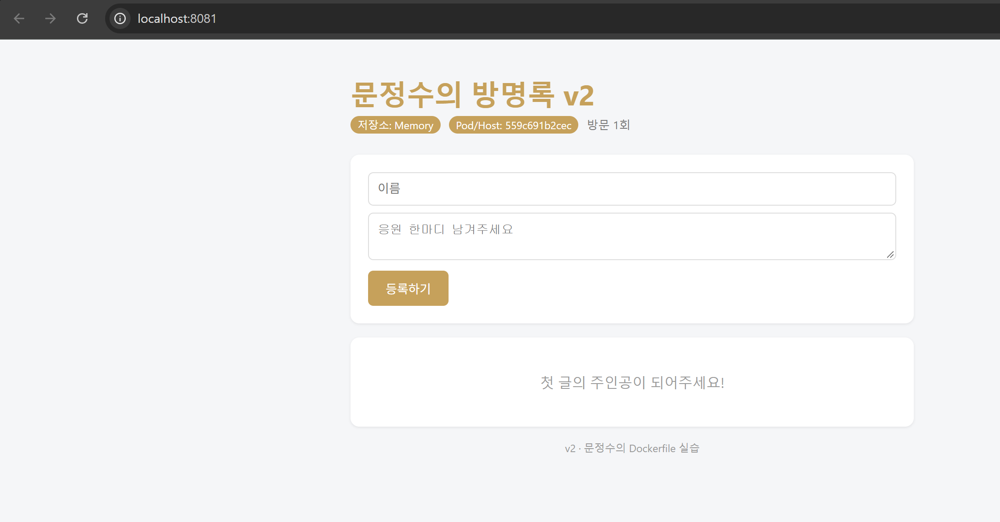
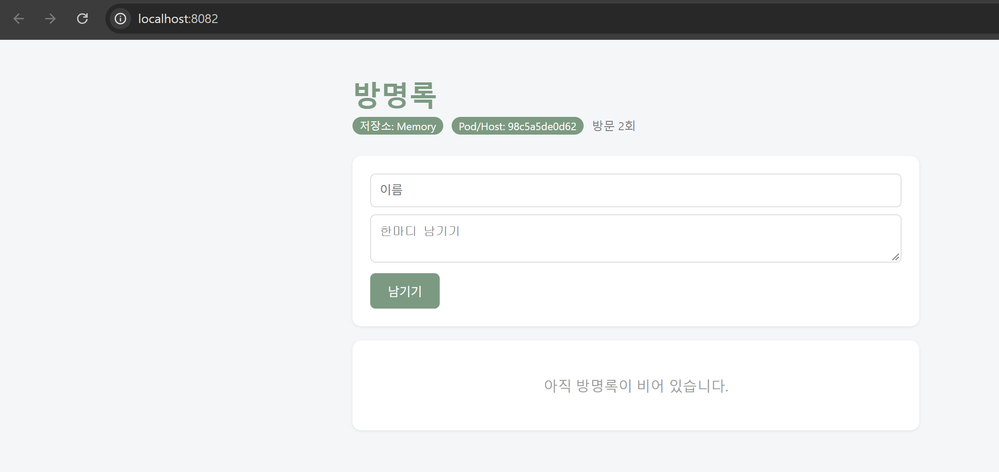
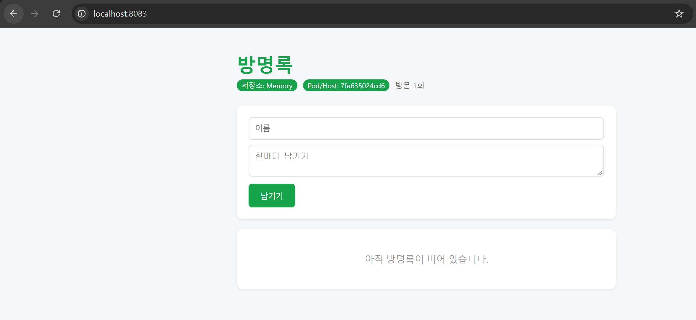

# 6주차 - 도커파일

방명록 앱을 Dockerfile로 이미지로 만들어서 ghcr.io에 올렸다.
다른 사람 이미지도 받아서 실행해 보고, 그 위에 내 설정을 넣어서 다시 만들어 봤다.

## 내 이미지
- ghcr.io/vkd3065/guestbook:v1
- ghcr.io/vkd3065/guestbook:v2 (제목, 색, 문구 바꾼 버전)

## 친구 이미지 실행
친구가 없어서  교수님 이미지로 했다. ㅠㅠ
- ghcr.io/makyraen/inhatc-devops-guestbook:v1 → localhost:9090
- 내 컴퓨터에 코드도 없고 Flask도 안 깔았는데 그냥 실행됐다.



## Dockerfile 한 줄씩
| 줄 | 하는 일 |
|---|---|
| FROM python:3.12-slim | 파이썬이 깔려 있는 이미지에서 시작 |
| WORKDIR /app | /app 폴더에서 작업 (없으면 만들어줌) |
| COPY requirements.txt . | 라이브러리 목록만 먼저 복사 |
| RUN pip install --no-cache-dir -r requirements.txt | Flask, redis 설치. 빌드할 때만 실행됨 |
| COPY . . | 나머지 코드 복사 |
| RUN useradd -m appuser / USER appuser | root 말고 appuser로 실행하려고 계정 만듦 |
| ENV APP_TITLE=… THEME_COLOR=… | 제목이랑 색 기본값 |
| EXPOSE 5000 | 5000번 포트 쓴다고 적어두는 것. 이것만으로는 안 열리고 -p 해야 됨 |
| CMD ["python", "app.py"] | 컨테이너 켜질 때 실행할 명령 |

requirements.txt를 먼저 복사하는 이유는 코드만 고쳤을 때 pip install을 다시 안 하게 하려고.

## 빌드 캐시
아무것도 안 바꾸고 다시 빌드했더니 전부 CACHED로 넘어가서 바로 끝났다.
문구 하나만 바꿨을 때는 pip install까지는 CACHED고 COPY . . 부터만 다시 됐다.
```
#6 [2/6] WORKDIR /app
#6 CACHED
#7 [3/6] COPY requirements.txt .
#7 CACHED
#8 [4/6] RUN pip install --no-cache-dir -r requirements.txt
#8 CACHED
#9 [5/6] COPY . .
#9 CACHED
#10 [6/6] RUN useradd -m appuser
#10 CACHED
```
전체 로그: build-cache.txt

## 나만의 방명록 V2
제목, 색(보라), 입력칸 문구, 버튼 글자, 아래 문구를 바꿨다.
-e 없이 띄우면 보라색이고, -e로 THEME_COLOR를 금색으로 주니까 금색으로 바뀌었다.
제목은 안 건드려서 그대로였다.




## 친구 이미지 위에 내 설정 굽기
교수님 이미지를 FROM으로 쓰고 ENV만 바꿔서 guestbook:custom을 만들었다.



```
IMAGE          CREATED      CREATED BY                                   SIZE
0a22d9ba25fe   6 days ago   ENV APP_TITLE=방명록 THEME_COLOR=#7C9A82     0B
<missing>      6 days ago   CMD ["python" "app.py"]                      0B
<missing>      6 days ago   EXPOSE [5000/tcp]                            0B
<missing>      6 days ago   ENV APP_TITLE=InhaTC DevOps 방명록 THEME_COL…   0B
```
맨 위 줄만 내가 추가한 거고 나머지는 원래 이미지 그대로다.
ENV가 두 번 나오는데 내가 쓴 게 나중이라 그게 적용됐다.

## 설정 넣는 방법 3가지
- app.py 기본값: 코드에 적힌 값. 바꾸려면 코드 고치고 다시 빌드
- Dockerfile ENV: 이미지 만들 때 들어가는 값. 바꾸려면 다시 빌드
- docker run -e: 실행할 때 주는 값. 컨테이너만 다시 띄우면 됨

우선순위는 코드 < ENV < -e.
세이지색으로 만든 이미지에 -e로 초록을 줬더니 초록이 나왔다.



## 느낀 점
- 처음에 태그 없이 run 했다가 latest가 없어서 안 됐다. latest가 최신이라는 뜻이 아니었다.
- ghcr에 올리면 처음엔 Private이라 Public으로 바꿔야 한다.
- 이미지를 공유해도 방명록 글은 같이 안 넘어간다. 데이터는 각자 컨테이너에 있다.
